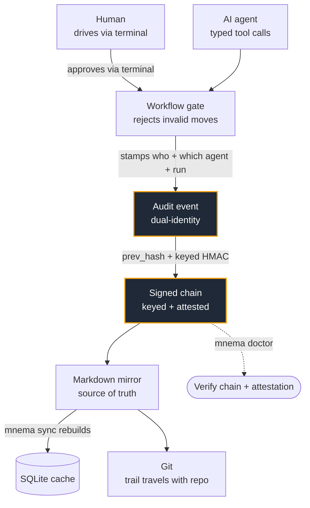

<h1 align="center">
  <br>
  mnema
  <br>
</h1>

<p align="center"><em>a tamper-evident audit chain for AI-agent work</em></p>

<p align="center">
  <a href="https://www.npmjs.com/package/@felipesauer/mnema"></a>
  <a href="https://www.npmjs.com/package/@felipesauer/mnema"></a>
  <a href="https://modelcontextprotocol.io"></a>
  <a href="https://www.npmjs.com/package/@felipesauer/mnema"></a>
  <a href="./package.json"></a>
  <a href="./LICENSE"></a>
</p>

> A tamper-evident, local-first audit trail for AI-agent work.
> *You drive, agents execute — every change stamped with who authorized it and which agent ran it, in a log you can prove wasn't altered.*

Mnema is a local-first MCP server that gives external AI agents
(Claude Code, Cursor, Aider, …) typed tools to do work behind
workflow gates, while every action lands in a **cryptographically
verifiable** audit log that records **who** coordinated, **which**
agent executed, and in **which** run. The log is protected in depth: a
hash chain catches accidental corruption, a keyed HMAC and per-machine
signatures resist a real adversary, and an optional external anchor
proves *when* the head existed (see
[Integrity model](#integrity-model)). Humans drive through the
terminal and verify through the history. Mnema does not run agents — it
makes their work accountable.

> **Not a semantic-memory layer.** Mnema does not do embeddings or
> similarity recall — if you want an agent to *remember facts* across
> sessions, reach for Mem0 or Cognee. Mnema answers a different
> question: *what did the agents do, who authorized it, and can you
> prove the record wasn't altered?* It pairs cleanly with a memory
> layer; it doesn't replace one.

## Table of contents

- [Why Mnema](#why-mnema)
- [Quickstart](#quickstart)
- [What you get](#what-you-get)
- [Integrity model](#integrity-model)
- [Install](#install)
- [Project layout after `mnema init`](#project-layout-after-mnema-init)
- [Common CLI commands](#common-cli-commands)
- [How the MCP loop works](#how-the-mcp-loop-works)
- [Configuration](#configuration)
- [Workflows](#workflows)
- [Status](#status)
- [Getting help](#getting-help)
- [Further reading](#further-reading)
- [License](#license)

## Why Mnema

When an AI agent works in your repository, three questions usually go
unanswered: *what exactly did it change, did it skip the steps it was
supposed to follow, and can you trust the record after the fact?*
Mnema answers all three.

- **It makes agent work provable.** Every mutation appends to a
  hash-chained audit log that is protected in depth: the chain catches
  accidental corruption, a keyed HMAC and per-machine Ed25519
  signatures make a *deliberate* rewrite detectable (not just a broken
  link an attacker could repair), and an optional external anchor
  timestamps the head. `mnema doctor` verifies all of it — edits,
  truncation, replays, deletion, and downgrade. This is the part most
  agent tooling doesn't have; the exact guarantees and their limits are
  spelled out in [Integrity model](#integrity-model).
- **It keeps the human in the loop.** Agents move work through a
  workflow whose gates reject invalid transitions (no submitting a
  task with no acceptance criteria, no skipping review). You approve
  through the terminal; the agent can't route around you.
- **It records who did what.** Each event carries a dual identity —
  the human who coordinated, the agent that executed, the run it
  belonged to — so the history reads like a chain of custody.
- **It stays yours.** Local-first, zero telemetry, no remote
  services. SQLite + plain-text Markdown/JSONL in your repo; the
  files outlive Mnema and open in any editor.

| Instead of… | …you get |
|---|---|
| A task tracker with no cryptographic guarantee the log is intact | A keyed, signed audit chain that resists a deliberate rewrite, with `doctor` verification |
| A semantic memory layer (Mem0, Cognee) that recalls facts | A provable record of *actions taken*, not facts remembered |
| A heavyweight Jira/web UI | An MCP server + CLI that lives next to your code |
| Free-form agent prose you have to trust | Typed tools behind workflow gates that reject bad input |

## Quickstart

> **Status:** Mnema is published on npm as an alpha (see
> [Install](#install)). The surface is feature-rich and is still being
> hardened toward a stable `1.0`.

```bash
# 1. Install and initialise a project
npm install -g @felipesauer/mnema@alpha
cd my-project
mnema init --name "My App" --key "MYAPP"

# 2. Wire your AI client to the MCP server
mnema mcp install-instructions claude-code
```

Step 2 prints the exact registration command and config for your
client. For Claude Code it looks like this:

```text
Register with `claude mcp add` (preferred), or paste the JSON
below into ~/.claude.json under `mcpServers`:

  claude mcp add mnema -s user -e MNEMA_AGENT_HANDLE=claude-code -- mnema mcp serve
```

Run that `claude mcp add` line, restart your client, and confirm the
project is healthy:

```bash
mnema doctor          # all checks green on a fresh project
```

From here your agent drives Mnema through MCP tools, and you watch
and approve from the terminal — walked through end to end in
[How the MCP loop works](#how-the-mcp-loop-works).

### See it in 30 seconds

Drive a task through the gates, `doctor` proves the audit chain, then a
hand-edit to a past log line is caught — every frame is real output:


The same flow condensed, in case the animation doesn't play:

```console
$ mnema init --yes --name "Payments API" --key PAY
$ mnema task create --title "Add rate limiting"
$ mnema task move PAY-1 submit …   # drive it through the gates → approve → DONE
$ mnema doctor
  ✓ audit hash chain  verified

# now tamper: rewrite who did the work in a past audit line
$ mnema doctor
  ✗ audit hash chain  hash mismatch on a line in current.jsonl
```

<!-- The recording is docs/quickstart.cast (a real asciinema cast).
     Regenerate it with `node scripts/make-cast.mjs`, then re-render the GIF
     with `agg --speed 1.4 docs/quickstart.cast docs/quickstart.gif`. -->


## What you get

| Surface | What it does |
|---|---|
| **Audit log** | Every action appends to a hash-chained JSONL log (mirrored to SQLite), keyed with a per-project HMAC secret and periodically signed by a per-machine Ed25519 key, with optional external anchoring. `mnema doctor` detects edits, truncation, replays, deletion, and downgrade — see [Integrity model](#integrity-model). |
| **Workflow gates** | A state machine per task; each transition declares required fields and Mnema rejects invalid moves. |
| **Agent runs & plans** | Wrap every batch of mutations in a run (parent/child, max depth 5); inspect any run later via the CLI. |
| **Dual identity** | Each event records the human actor, the agent that executed, and the run — a built-in chain of custody. |
| **Tasks, sprints, epics** | Full work tracking: tasks with acceptance criteria, estimate, assignee, transversal **labels** (e.g. `area:api`) and a token `context_budget`; one active sprint per project (with measurable metrics); epics grouping tasks under a derived lifecycle. |
| **Decisions (ADRs)** | proposed → accepted/rejected → superseded chains, each able to record which artefacts it impacts, with a shortcut to promote a note into a decision. |
| **Traceability layer** | Trace work end to end: task↔task dependencies and readiness, a navigable **dependency graph** (cycle detection, ready/blocked frontier, critical path), epic/sprint completion coverage, acceptance-criteria evidence (commit refs verified against git), **file-collision** warnings (related tasks that touch the same files, inferred from commit evidence), a navigable **provenance chain** (observation/note → decision → memory, walkable in both directions), a read-only work-graph lint, wikilinks between artefacts, and ADR impact queries. |
| **Queries & review flow** | An aggregate backlog query (counts + lists by state / epic / sprint / label / date / text), a per-run diff of everything one agent session changed, an **executive snapshot** of an epic or sprint (coverage + graph + inbox, rendered to Markdown or HTML), and an active inbox that surfaces review-SLA breaches, per-state **WIP-limit** breaches, and orphaned runs. |
| **Live dashboard & metrics** | `mnema serve` — a dark, tabbed **local dashboard** (Overview / Flow / Activity / Graph, inline-SVG charts including a dependency node-link diagram) that streams each audit event over SSE in real time; loopback-only and self-contained, so nothing leaves your machine. `mnema metrics` — a local adoption report (time-to-first-done, feature activation, doctor use, skill adoption), derived from the trail with no telemetry. |
| **Full-text search** | Search across tasks, decisions, notes and more — case- and accent-insensitive. |
| **Attachments** | Files attached to a task or decision, deduplicated by content hash. |
| **Skills, memories, observations** | Knowledge the agent records as it works (and humans curate) via MCP tools, mirrored to plain `.md` files so it travels with the repo (not semantic recall — see the note above). A skill can be **invocable** with **dynamic context** — read-only `mnema` commands whose live output (e.g. `mnema tasks ready`) is embedded when the skill is shown. Memories can be **archived** when stale (hidden from listing and search, kept in the record). User-level skills/memories under `~/.config/mnema/` merge in read-only, with the project always shadowing them. |
| **Slash commands** | Reusable command flows versioned under `.mnema/commands/*.md` — a named bundle of `mnema` calls (e.g. `/standup` = bootstrap + inbox + today's history), discovered and surfaced to your client through MCP tools and the CLI. |
| **Workflows** | 4 presets (`default`, `lean`, `kanban`, `jira-classic`) plus custom JSON validated against a schema. |
| **MCP tools** | A broad set of universal tools plus one per workflow action; `context_bootstrap` is the canonical session entry point. |

## Integrity model

"Tamper-evident" is a claim that deserves to be precise, so here is
exactly what protects the log, what each layer buys you, and — just as
important — what it does *not* defend against. The protection is
layered: each one catches what the one below it can't.

### The three layers

**Layer 1 — hash chain (always on).** Every event carries the hash of
the one before it, so the log is a chain. This catches **accidental**
corruption, reordering, and truncation: flip a byte in a past line and
the links stop matching. On its own a plain chain is *not* proof
against a deliberate attacker — someone who edits a past line can also
recompute every hash after it and hand you a chain that still links
cleanly. That is what the next layers close.

**Layer 2 — authenticity (keyed HMAC + machine signatures).** Two
independent secrets an in-repo attacker doesn't have:

- **Per-project HMAC secret.** Each event's hash is keyed with a secret
  that lives **outside the repo** at
  `~/.config/mnema/projects/<key>/hmac.key` (mode `0600`). Only a
  non-secret fingerprint is committed. Recomputing the chain now
  requires the secret, not just the algorithm — so an agent (or anyone)
  with write access to the repo files cannot forge a valid rewrite.
- **Per-machine Ed25519 signatures.** At a checkpoint interval the
  chain *head* is signed by a per-machine private key (also `0600`,
  outside the repo); the public key is committed as
  `.mnema/keys/<actor>.<fingerprint>.pub` so any clone can verify. A
  signed checkpoint pins the chain length: rolling the log *back* below
  a signed checkpoint is detected as tampering, not mistaken for a
  crash.

The **v3→v2 downgrade** — stripping the keyed events to pass off an
unkeyed chain — is closed by version monotonicity plus a
fingerprint-implies-v3 rule, so an attacker can't quietly drop to the
weaker format.

**Content attestation — verifiable by anyone, no secret needed.** The
HMAC proves authenticity only to a *secret-holder*; a **public clone or
an outside reviewer** has no way to check it. So the per-machine Ed25519
key also signs a **content-recomputable root** over each batch of
events, committed as `.mnema/audit/attest/<to>.att`. A stranger
recomputes that root from the events on disk and verifies the signature
against the committed public key — with **no secret at all**. Editing
any covered event changes the root and breaks the signature; without
this, editing v3 content passed green for anyone lacking the project
secret. Attestations are emitted automatically at each checkpoint;
`mnema audit reattest` backfills or repairs them. `mnema audit verify`
reports coverage per batch and **never shows green beyond the last
attestation**.

**Layer 3 — temporal anchoring (opt-in, default `none`).** A pluggable
provider stamps the signed head into an external, independently
verifiable record, so you can prove the head *existed at a point in
time* — defending against someone who controls the machine and its keys
but can't rewrite external history. It runs **off the write path** and
**fail-open** (a provider outage never blocks a mutation). The
`git-signed` provider ships; network providers (`opentimestamps`,
`rfc3161`) are deferred by design. See
[Configuration](#configuration) to enable it.

`mnema doctor` verifies layers 1 and 2 offline every run;
`mnema audit verify --verify-anchors` additionally checks layer-3
receipts against the provider.

### Threat model

**What Mnema detects:**

| Attack | Caught by |
|---|---|
| Editing a past event | Layer 1 (chain) + Layer 2 (HMAC) |
| Editing a past event, checked by someone *without* the secret | Layer 2 content attestation — the committed `.att` breaks |
| Recomputing hashes to hide an edit | Layer 2 — no HMAC secret, so the recomputed chain fails |
| Deleting or reordering events | Layer 1 |
| Rolling the log back below a signed checkpoint | Layer 2 signatures |
| Downgrading the keyed chain to the unkeyed format | Version monotonicity + fingerprint-implies-v3 |
| Backdating a forged history | Layer 3 anchor (when enabled) |

**What Mnema does *not* defend against (be honest about the edges):**

- **A compromised machine that holds the private keys.** If an attacker
  has both repo write access *and* the `0600` keys under
  `~/.config/mnema`, they can produce a valid rewrite. The keys living
  outside the repo raises the bar past "any agent with file access";
  it does not survive full host compromise. Anchoring (layer 3) is what
  narrows even this, by pinning the head to external history.
- **Truncating events written *after* the last attestation.** Removing
  the most recent, not-yet-attested tail is indistinguishable from a
  recoverable crash — both look like a chain that stops early. Content
  attestation bounds this to the window since the last `.att`, and
  `verify` never shows green past it; closing the window entirely for a
  public clone needs an enabled anchor (layer 3), which pins the head to
  external history. This is a documented limitation, not a bug.
- **A dishonest coordinator.** Mnema records *who authorized* and
  *which agent executed*; it does not judge whether the human should
  have. It is a chain of custody, not a policy engine.

The honest one-line summary: the chain alone catches accident and the
keyed, signed layers catch a deliberate in-repo rewrite; defeating all
of it requires compromising the machine's out-of-repo keys, and even
then an enabled anchor leaves a trace.

## Install

The Quickstart above covers the common path
(`npm install -g @felipesauer/mnema@alpha`). A few platform notes:

- Alpha releases live under the `alpha` dist-tag, so install with
  `@alpha` to be explicit about what you're getting. (Until the first
  stable `1.x` ships, `latest` also points at the current alpha.)
- The native SQLite binding (`better-sqlite3`) installs a **prebuilt
  binary** with npm/npx — no compiler needed. With **pnpm**, run
  `pnpm approve-builds better-sqlite3` afterwards (pnpm blocks build
  scripts by default). Platforms without a prebuilt binary need a C++
  toolchain (`python3`, `make`, `g++`).

To work from source instead:

```bash
git clone https://github.com/felipesauer/mnema.git
cd mnema
pnpm install
pnpm build
ln -s "$PWD/mnema" /usr/local/bin/mnema   # optional, for global access
mnema --version
```

The bundled `./mnema` shell script forwards to `dist/index.js` —
useful for dogfooding without a global install.

### Adopting an existing project

You don't have to start clean. `mnema init --minimal` then
`mnema adopt all` eases Mnema into a repo that already has work, and
`mnema import markdown` / `mnema import github-issues` pull legacy
items in.

## Project layout after `mnema init`

```
my-project/
├── AGENTS.md                 # operating manual for agents (generated by init)
├── .gitignore                # pre-seeded: ignores only the local cache
├── .gitattributes            # audit log merges append-only (merge=union)
└── .mnema/                   # everything Mnema owns
    ├── mnema.config.json     # project configuration (versioned)
    ├── audit/                # append-only event log (versioned by default)
    │   └── current.jsonl
    ├── keys/                 # committed public verification material only
    │   ├── project.hmac-id   #   non-secret fingerprint of the HMAC secret
    │   └── <actor>.<fp>.pub  #   per-machine Ed25519 public key
    ├── state/                # local cache — gitignored
    │   └── state.db          #   SQLite (FTS, tasks, runs, audit metadata)
    ├── backlog/              # one .md per task, foldered by workflow state
    │   ├── DRAFT/MYAPP-1.md  #   carries its epic_key / sprint_key link
    │   ├── READY/
    │   └── …
    ├── sprints/              # one .md per sprint, mirrored from the DB
    ├── roadmap/              # one .md per epic and per decision (ADR)
    ├── memory/               # agent/human-recorded facts, mirrored to .md
    ├── skills/               # agent-recorded skills, mirrored to .md
    ├── commands/             # versioned slash-command definitions (.md)
    ├── config.local.json     # optional personal overrides — gitignored
    └── workflows/
        └── default.json      # active state machine
```

### What to commit, and the dirty-tree question

Mnema is a SQLite-first store with a markdown mirror, and the split
between the two decides what belongs in git:

- **Commit it.** The markdown mirror — `backlog/`, `roadmap/`,
  `sprints/`, `memory/`, `skills/` — and the `audit/` log are the
  version-controlled record of the work. They survive a fresh clone and
  are what a teammate (or another machine) reads. `mnema.config.json`
  and the active `workflows/*.json` are versioned too. So is
  `.mnema/keys/` — but note it holds **only public verification
  material** (the HMAC fingerprint and per-machine `.pub` files), never
  a secret; committing it is what lets any clone *verify* the chain.
- **Ignore it.** `.mnema/state/` is local: the SQLite cache, the sync
  buffer and attachment blobs — all *derived* and rebuilt from the
  markdown with `mnema sync`. The optional `.mnema/config.local.json`
  (per-repo personal overrides) is local too. `mnema init` pre-seeds the
  `.gitignore` lines for exactly these — nothing more.
- **Never in the repo at all.** The integrity *secrets* — the
  per-project HMAC key and the per-machine Ed25519 private key — live
  outside the repo under `~/.config/mnema/` (mode `0600`) and are never
  written into `.mnema/`. That out-of-repo placement is what puts them
  beyond an in-repo agent's reach (see
  [Integrity model](#integrity-model)); back that directory up
  separately, because a lost private key means a new machine re-mints
  its own (old signatures still verify from the committed `.pub`).

Because the mirror is versioned, those `.md` files **do** change on
every mutation and show up in `git status` — that is the trail, not
noise to suppress. The one place this used to bite was the append-only
`audit/*.jsonl`: two branches that both recorded activity would conflict
on the tail. `mnema init` writes a `.gitattributes` that gives the audit
log git's built-in `union` merge driver, so a merge keeps both sides
instead of raising a conflict (no `.git/config` setup needed). If two
divergent histories ever interleave the hash chain, `mnema doctor`
flags it and `mnema sync` rebuilds the cache from the markdown.

If you would rather treat the whole store as a private local cache, add
`.mnema/` to your `.gitignore` instead — you keep a clean tree but give
up the cross-clone history that is part of what Mnema offers.

That trail churn is legitimate, but you rarely want it mixed into a code
diff. `mnema commit` keeps them apart without hiding either:

```bash
git add src/rate-limit.ts          # stage the code you want to commit
mnema commit -m "feat: add rate limiting"
# → commit 1  chore(mnema): update trail   (.mnema/ only)
# → commit 2  feat: add rate limiting      (your staged code)
```

It makes two commits — the `.mnema/` trail first (default message,
overridable with `--trail-message`), then your code. The trail is staged
for you; **your code is whatever you already staged** with `git add` (or
`git add -p`) and is committed straight from the index, so unstaged edits
and partial staging are preserved — the helper never `git add`s your code,
never amends, and never pushes. An empty bucket is skipped rather than
committed. Use `--trail-only` to commit just the trail. It refuses to run
mid-merge/rebase so it can't leave a half-finished state.

### Log growth and rotation

The audit log rotates by month: `current.jsonl` receives new events, and
at the first write of a new month the previous file is rolled to
`audit/YYYY-MM.jsonl`. The hash chain runs **continuously across those
segments** — the first line of each file links to the tail of the one
before it — and `mnema doctor` verifies the whole chain end to end,
segment boundaries included. Deleting or editing an archived month is
caught the same as tampering with `current.jsonl`.

Growth is modest and bounded per month: one compact JSON line per
mutation (JSONL compresses well under git's packing), and completed-task
markdown stays as small per-task files. Even on a large project history,
verifying the full chain (`mnema doctor`) takes single-digit
milliseconds and a mirror rebuild (`mnema sync`) well under a second —
measured by `pnpm bench:scale`. The `audit_strategy` and `audit_retention_months`
config keys are reserved for a future compaction pass (compressing or
pruning old months); they are accepted today but not yet enforced.

## Common CLI commands

You drive Mnema from the terminal; agents drive the same model through
MCP tools. The commands group by what you're doing — run
`mnema <command> --help` for full flags and examples.

**Set up & adopt**

| Command | What it does |
|---|---|
| `mnema init` | Create the full layout (`--minimal` for adoption, `--profile audit-only` for a core-only surface) |
| `mnema adopt <component>` | Add `skills/`, `memory/` or `roadmap/` later |
| `mnema import markdown --from PATH` | One-shot import from `## STATE Title` headings |
| `mnema import github-issues --repo OWNER/REPO` | One-shot import from GitHub Issues |

**Track work**

| Command | What it does |
|---|---|
| `mnema task create / list / show / move` | Manage tasks (`create` takes `--estimate`, `--context-budget`, `--priority`, `--label`) |
| `mnema task assign <key> --to <handle>` | Set or clear a task's assignee (`--clear`); an unknown handle is rejected |
| `mnema task label <key> [labels...]` · `mnema task labels` | Set a task's transversal labels (omit to clear); list the label catalogue with counts |
| `mnema sprint plan / start / close / show / add` | Manage sprints (one active per project) |
| `mnema sprint add-tasks <key> <task...>` | Attach several tasks at once (best-effort, reports per-task failures) |
| `mnema sprint metric <key> --name --target` | Add a measurable metric (baseline/unit/due optional) |
| `mnema epic create / show / add / close` | Group tasks; `show` includes the derived lifecycle |
| `mnema decision record / accept / reject / supersede` | Manage ADRs (`record` takes `--impact`) |
| `mnema note add` · `mnema attach add <task> <file>` | Annotate a task; attach a file deduped by SHA-256 |

**Trace & verify**

| Command | What it does |
|---|---|
| `mnema task depends <key> <blocksKey>` · `mnema task ready` | Declare a task↔task dependency; list tasks whose blockers are all done |
| `mnema graph [--epic\|--sprint]` | Dependency graph: cycles, the ready/blocked frontier, and the critical path |
| `mnema snapshot [--epic\|--sprint] [--out FILE]` | Executive snapshot (coverage + graph + inbox) as Markdown or HTML |
| `mnema query [--state --epic --sprint --label --since --until --text]` | Aggregate backlog query — counts + lists across any combination of filters |
| `mnema task evidence <key> [--criterion --kind --ref]` | List or attach evidence for acceptance criteria (a `--kind commit` ref is checked against git) |
| `mnema sprint coverage <key>` · `mnema epic coverage <key>` | Report % of tasks in a terminal state |
| `mnema lint sprint <key>` · `mnema lint epic <key>` | Integrity checks (incomplete tasks, subagent-bypass, broken deps) |
| `mnema decision impacting <ref>` | Which ADRs affect a given artefact |
| `mnema search <query>` | Full-text search across the project |

**Inspect & operate**

| Command | What it does |
|---|---|
| `mnema doctor` | Read-only diagnostic — re-verifies the audit chain and machine attestation offline. Add `--rebuild-mirrors` to recreate missing `.md` from the database |
| `mnema audit verify [--verify-anchors]` | Verify the chain + attestation; with `--verify-anchors`, also check the temporal anchors (layer 3) online |
| `mnema history --since=today` · `mnema watch` | Compact activity view; live tail of mutations |
| `mnema inbox` | Tasks awaiting your review or blocked, plus review-SLA breaches |
| `mnema serve` | Live local dashboard on `localhost` — dark, tabbed (Overview / Flow / Activity / Graph), pushes each audit event over SSE as it lands. Loopback-only, read-only, zero external assets |
| `mnema stats [--since]` | Derived flow metrics from the audit log (throughput, lead/cycle time, reopen rate, velocity) |
| `mnema metrics [--json]` | Local adoption report (time-to-first-done, feature activation, doctor use, skill adoption) — derived locally, no telemetry |
| `mnema agent inspect <run_id>` · `mnema agent diff <run_id>` | One run with its plans + mutations; a grouped diff of everything that run changed |
| `mnema agent close-orphans [--apply]` · `mnema audit query [filters]` | Find (and abort) runs left open past the threshold; raw log access |
| `mnema sync` | Rebuild the SQLite cache from the markdowns |
| `mnema commit -m "…"` | Commit the `.mnema/` trail and your code as two separate commits (trail first) |
| `mnema skill lint / links / refs` · `mnema memory consolidate` | Validate skills & wikilinks; regenerate memory `INDEX.md` |
| `mnema memory archive <slug>` | Archive a stale memory — hidden from listing and search, kept in the record |
| `mnema commands list / show` | Discover the versioned slash-command flows under `.mnema/commands/` |

**Keep current after a package upgrade**

| Command | What it does |
|---|---|
| `mnema upgrade` | Detect everything out of date (pending migrations, stale AGENTS.md, missing mirrors, old `mnema_version`), show the plan, and apply it after confirmation (`--yes` to skip) |
| `mnema update check` | Check the npm registry for a newer published Mnema (on demand, regardless of the `update_check` flag; fail-open when offline) |
| `mnema agents sync` | Regenerate only the Mnema-managed block of AGENTS.md (with `@path` imports expanded, e.g. the live memory index), preserving your own content |

**Integrate (MCP)**

| Command | What it does |
|---|---|
| `mnema mcp serve` | Start the MCP server on stdio (called by your AI client) |
| `mnema mcp install-instructions <client>` | Print the right config snippet |

### Live dashboard

`mnema serve` opens a dark, tabbed dashboard on `localhost` and pushes
each audit event to it in real time — so you watch the project move as
agents (or you) work, without refreshing:

```bash
mnema serve            # → http://127.0.0.1:4700, opens your browser
```

- **Overview** — coverage, throughput/lead/cycle time, WIP vs limits, SLA
  breaches, and the chain verdict.
- **Flow** — velocity, reopen rate, estimate-vs-actual, throughput over time.
- **Activity** — a live event feed (filterable) plus events-by-kind.
- **Graph** — the dependency graph as a node-link diagram with the critical
  path highlighted.

It is strictly read-only and derives everything from what's already
recorded — no new collection. The server binds the loopback interface
only and the page is self-contained (no external requests, no chart
library), so **nothing leaves your machine**. It receives events from
*any* process (an agent over MCP, a CLI mutation) by watching the trail.

## How the MCP loop works



*The diagram is the accountability spine — where every action ends up. The
steps below are the agent's tool-call lifecycle that feeds it:*

1. Your AI client (Claude Code, Cursor, …) spawns `mnema mcp serve`
   with `cwd` pointing at your project. Configure it once via
   `mnema mcp install-instructions claude-code` (the printed snippet
   already includes the right `agent_handle`).
2. The agent calls `context_bootstrap` first — it gets the project
   identity, active workflow, recent decisions and pointers to
   memory.
3. Before any mutation it calls `agent_run_start({ goal })` — without
   an active run, mutations are rejected with `NO_ACTIVE_RUN`.
4. It then uses `task_create`, `task_submit`, `task_block`, … as the
   workflow allows. Every transition is validated against the gate
   (`task_submit` requires `title`, `description`,
   `acceptance_criteria`, `estimate`).
5. When done, `agent_run_end({ status: "completed" })` flushes the
   sync buffer and closes the run.

### A concrete pass

An agent asked to "add a rate limiter" might: start a run, create
`MYAPP-12`, submit it through the gate (which forces acceptance
criteria and an estimate), move it to `IN_PROGRESS`, do the work,
then submit it for review. It cannot mark its own task `DONE` — the
`default` workflow routes that through your approval. Meanwhile you
watch and inspect from the terminal:

```bash
mnema watch                        # live tail of every mutation
mnema inbox                        # what's waiting on your review
mnema history --since=today        # formatted activity log
mnema agent inspect <run_id>       # one run, with its plans + mutations
mnema agent resume <run_id>        # reattach to an interrupted run
mnema doctor                       # re-verify the audit chain anytime
```

Approve with `mnema task move MYAPP-12 approve`, and the whole
sequence — who, which agent, which run, in what order — is sitting in
the hash-chained audit log, verifiable forever.

## Configuration

`.mnema/mnema.config.json` is the only configuration. Minimal fields:

```json
{
  "version": "1.0",
  "mnema_version": ">=0.10.0-alpha.0 <1.0.0",
  "project": { "key": "MYAPP", "name": "My Application" },
  "workflow": "default"
}
```

Optional fields cover custom paths, audit retention, sync flush
thresholds, feature flags, and an `aging` block — `stale_after_days`,
per-state review SLAs (`sla_days`, e.g. `{ "IN_REVIEW": 2 }`), and
`orphan_run_after_hours` — that drives what `mnema inbox` and
`mnema doctor` flag. Run `mnema doctor` after editing — it re-validates
the file against the schema and reports anything that drifted.

One optional field worth calling out is `enforcement_mode`, which decides
what a failed workflow gate means:

| Mode | A failed gate… |
|---|---|
| `strict` *(default)* | blocks an agent; a human may override, and the override is audited |
| `blocking` | blocks everyone, no override |
| `advisory` | only warns — anyone may proceed, and the skipped gate is audited |

`mnema doctor` prints the active mode so its effect is never a surprise.

### Integrity: checkpoint & anchoring

The [integrity model](#integrity-model) works out of the box with no
configuration — the HMAC key and the per-machine signing key are minted
on first use. Two optional `audit` blocks tune it, and both are safe to
leave unset:

```json
{
  "audit": {
    "checkpoint": { "events": 100, "seconds": 3600 },
    "anchor": {
      "provider": "git-signed",
      "interval": { "events": 500 },
      "remote": "origin",
      "ref": "refs/mnema/anchors"
    }
  }
}
```

- **`audit.checkpoint`** — how often the chain head is signed (layer 2).
  A checkpoint fires when *either* `events` new events accrue *or*
  `seconds` elapse, whichever comes first (defaults `100` / `3600`). A
  shorter interval shrinks the "truncate the unsigned tail" window
  called out in the [threat model](#threat-model), at the cost of more
  signatures.
- **`audit.anchor`** — temporal anchoring (layer 3), `provider: "none"`
  by default (nothing leaves your machine). Set `git-signed` to stamp
  the signed head into a git object off the write path; add
  `remote`/`ref` to push it, or omit them to keep it local-only. The
  `rfc3161` provider additionally requires a `tsa` https URL. `interval`
  sets the anchoring cadence and falls back to the checkpoint interval
  when unset.

### npm update check

By default Mnema never phones home. If you *want* it to tell you when a
newer version is published, opt in:

```json
{ "features": { "update_check": true } }
```

With it on, `mnema doctor` compares your installed version against the
npm registry's latest and surfaces a hint (fail-open and cached, so an
offline machine just skips it — no usage data is ever sent). Regardless
of the flag, `mnema update check` runs the same check on demand.

### Audit-only profile

If you only want the core thesis — a tamper-evident audit log, workflow
gates and `doctor` — without the project-management surface (epics,
sprints, decisions/ADRs, skills, memories), initialise with the
audit-only profile:

```bash
mnema init --name "My App" --key "MYAPP" --profile audit-only
```

This picks the `lean` workflow and sets `features.knowledge: false`, so
the MCP server advertises a **small core** of tools (audit, tasks, runs,
plans, dependencies, evidence, search) instead of the full set — the
agent isn't shown epic/sprint/knowledge tools it can't meaningfully use.
Nothing is deleted: flip `features.knowledge` back to `true` (or switch
to a fuller workflow) to grow into the complete surface, and use
`mnema adopt` to add the skills/memory/roadmap directories when you want
them. The default profile (`full`) keeps every surface on.

The MCP surface is organised into conceptual **layers** so an agent (and
you) reason about a handful of buckets instead of one flat list of
tools. `context_bootstrap` returns the exact per-tool grouping for the
project as `tool_groups`, each flagged enabled/disabled for the active
profile:

| Layer | Enabled when | Examples |
|---|---|---|
| **Core** | always | `audit_query`, `audit_verify`, `task_*`, `agent_run_*`, `graph_dependencies`, `snapshot_generate` |
| **Workflow transitions** | always | one `task_<action>` per workflow transition (`task_submit`, `task_approve`, …) |
| **Planning** | workflow enables epics and/or sprints | `epic_create`, `sprint_start`, `epic_coverage`, `sprint_lint` |
| **Knowledge** | `features.knowledge` | `decision_*`, `skill_*`, `memory_*`, `observation_*`, `provenance`, `wikilink_references` |

The audit-only profile leaves only **Core** and **Workflow transitions**
on.

### User-level defaults

A `~/.config/mnema/config.json` lets you set **behavior preferences once**
for every project on your machine — `enforcement_mode`, `audit_strategy`,
`audit_retention_months`, and the `sync` / `features` / `aging` blocks. A project's
own config always wins key-by-key; the user file only fills the gaps. It
cannot set project identity, `paths` or `workflow` — those are intrinsic
to a project and an attempt to set them is rejected. Example:

```json
{ "enforcement_mode": "strict", "sync": { "mode": "push" } }
```

### Per-repo personal overrides

A gitignored `.mnema/config.local.json` is the local counterpart: same
behavior-only fields, but scoped to **one repo** and **your machine**, so
you can loosen `enforcement_mode` in dev without touching the team's
committed config. Precedence runs user global < project config < local
override; like the user file, it can never change project identity,
`paths` or `workflow`. `mnema init` gitignores it for you.

### Domain-event hooks

A `hooks` block runs a command when a **domain** event fires — a
task reaching a done state, a decision accepted, a sprint or epic
closed — not on generic tool calls. Each hook is an **argv pair**
(`command` + `args`) spawned **without a shell**, and receives the
triggering audit event as JSON on stdin:

```json
{
  "hooks": {
    "on_task_done": [{ "command": "./scripts/notify.sh", "args": ["--to", "done"] }],
    "on_decision_accepted": [{ "command": "./scripts/log-decision.sh", "args": [] }]
  }
}
```

Supported events: `on_task_done`, `on_task_transitioned`,
`on_decision_accepted`, `on_sprint_closed`, `on_epic_closed`.

**Hooks require your approval before they run.** Because
`mnema.config.json` lives in the repo and agents can edit it, a
configured hook block is **inert** until a human approves it:

```
mnema hooks show      # review the configured hooks + approval status
mnema hooks approve   # trust the current block to execute
```

Approval records a fingerprint of the exact hook block (stored outside
the repo, under `~/.config/mnema/approvals/`), so **any later edit to the
block revokes the approval automatically** — an agent that rewrites your
hooks can never make new commands run. An un-approved firing is still
recorded on the trail as a `hook_ran` with `outcome: "skipped"`. Because
hooks run as argv with no shell, metacharacters like `$(…)`, `|` and `;`
are inert data, never interpreted.

Hooks run **after** the triggering event is durably written, and each
firing records its own `hook_ran` audit event (with the exit code) — a
hook is part of the trail, never a phantom side effect. A failing or
hung command (30s timeout) is captured and audited; it never rolls back
the state that triggered it.

## Workflows

Workflows are JSON files in `workflows/`. The default ships with
seven states — `DRAFT → READY → IN_PROGRESS → IN_REVIEW → DONE`,
with `BLOCKED` and `CANCELED` branches. Each transition declares
its gate (which fields are required, with min/max/enum/format
constraints expressed in a small JSON DSL) — Mnema translates the
gate into Zod at boot time and surfaces one MCP tool per transition.

To switch presets, edit `workflow` in `mnema.config.json` and run
`mnema doctor`. To author a new workflow, copy
[workflows/default.json](workflows/default.json) and tweak.

## Status

Mnema is **alpha** and published on npm. The accountability core —
the part that's the actual differentiator — is in place and hardened:
the hash chain, its keyed-HMAC and per-machine-signature layers,
`doctor` tamper-detection, dual-identity capture, workflow gates, and
optimistic-concurrency lost-write protection described in
[Why Mnema](#why-mnema), [What you get](#what-you-get), and
[Integrity model](#integrity-model). The work-tracking and
traceability surface around it is built out; the remaining road to a
stable `1.0` is hardening and ergonomics, not missing pillars.

Confidence comes from how hard it's shaken out: a **comprehensive test
suite (0 skipped), lint + build clean**, repeated adversarial review
sweeps (audit immutability, multi-actor concurrency, custom-workflow
validation, input-validation parity, ReDoS, and command/path-injection
on the newer surfaces) plus two dedicated refute-first audits of the
cryptographic layers — including canonicalisation proven byte-stable by
fuzzing and an attack matrix (edit, delete, reorder, downgrade,
rollback) run through the built binary — and a multi-check publish gate
([scripts/publish-check.sh](scripts/publish-check.sh)) plus an
end-to-end smoke run before every tag. See
[CHANGELOG.md](CHANGELOG.md) for the per-version history.

## Getting help

- **Bug or unexpected behaviour?** Open an issue — the bug-report
  template asks for `mnema --version`, repro steps, and (if relevant)
  a snippet of `.mnema/audit/current.jsonl`.
- **Question or idea?** Use [GitHub Discussions](https://github.com/felipesauer/mnema/discussions).
- **Security issue?** Report it privately — see [SECURITY.md](SECURITY.md).
- **Want to contribute?** Start with [CONTRIBUTING.md](CONTRIBUTING.md).

## Further reading

- **[CHANGELOG.md](CHANGELOG.md)** — per-version history, with
  rationale for every notable change.
- **[CONTRIBUTING.md](CONTRIBUTING.md)** — dev setup, commit
  conventions, smoke run, and what to watch out for when touching
  the schema, the audit log, or the workflow.

`mnema init` also writes an `AGENTS.md` into your project — the
operating manual a fresh AI agent reads on session start so it knows
how to drive Mnema responsibly. It lives in your repo, not this one.

## License

[MIT](LICENSE) © Felipe Sauer
