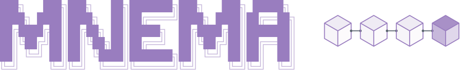
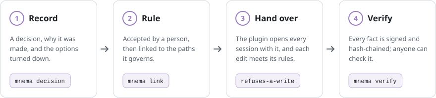
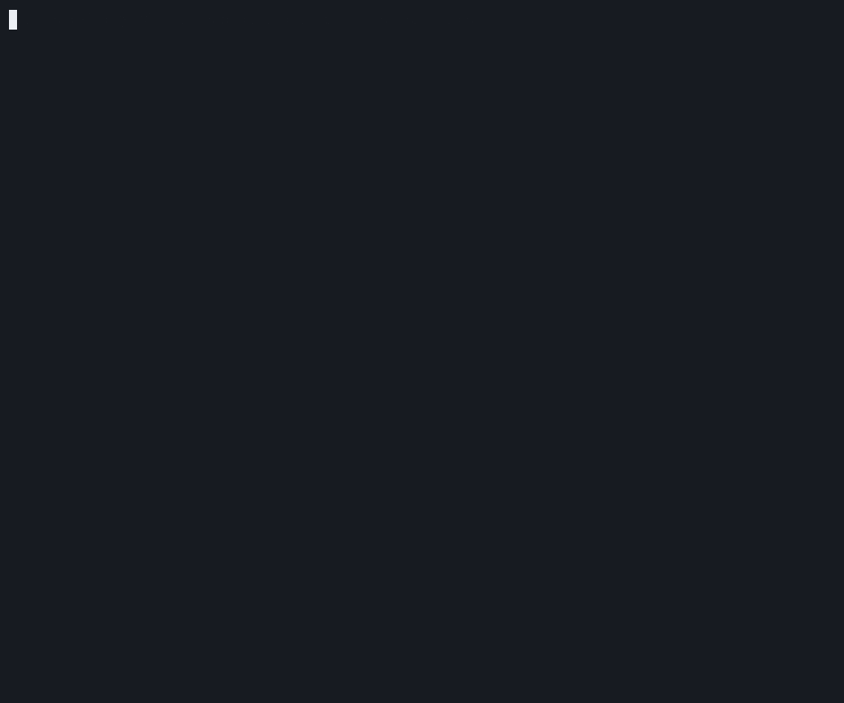
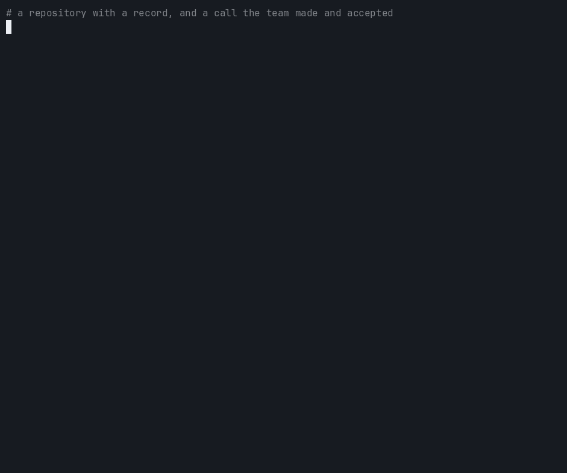

<div align="center">

<picture>
  <source media="(prefers-color-scheme: dark)" srcset="docs/assets/banner-dark.svg">
  
</picture>

<h3>Your decisions, handed to your agents' sessions and held at the edits they govern — append-only and signed in the repository, and checkable by anyone.</h3>

<p>
<a href="https://github.com/felipesauer/mnema/actions/workflows/ci.yml"></a>
<a href="https://github.com/felipesauer/mnema/releases"></a>
<a href="LICENSE"></a>

</p>

<p>
mnema keeps the calls behind your agents' work as signed, append-only facts in the repository. A
session opens with the ones in force, a rule can refuse or pause the write it governs, and
<code>mnema verify</code> checks the record with no key and no network.
</p>

<picture>
  <source media="(prefers-color-scheme: dark)" srcset="docs/assets/how-mnema-fits-dark.svg">
  
</picture>

</div>

<table>
<tr>
<th align="center">Remember</th>
<th align="center">Enforce</th>
<th align="center">Prove</th>
</tr>
<tr>
<td align="center" width="33%">With the plugin, each agent session opens with the decisions in force, by name and id.</td>
<td align="center" width="33%">A rule addressed at a path can refuse an agent's write there, or hold it for a person where the host allows.</td>
<td align="center" width="33%">Every write is signed and hash-chained; anyone can verify it, even in a browser.</td>
</tr>
</table>

<p align="center">
<sub>Claude Code · VS Code · Cursor CLI · GitHub Action · SDK · <code>mnema site</code>. The Action, the SDK and the VS Code extension run from a checkout; nothing is on npm yet.</sub>
</p>

<p align="center">
Tamper-evident, not tamper-proof: what is still in the record has not changed
since it was signed, and a stranger can check that without your keys and without
installing this.
</p>

<p align="center">
<a href="#quick-start">Quick start</a> · <a href="#how-it-works">How it works</a> · <a href="#features">Features</a> · <a href="#watch-it">Watch it</a> · <a href="#what-it-proves--and-what-it-does-not">What it proves</a> · <a href="#docs">Docs</a>
</p>

## Quick start

```sh
# install: npm i -g the four release tarballs; the exact line is in docs/install.md
claude plugin marketplace add felipesauer/mnema   # the plugin hands each session the record
claude plugin install mnema@mnema
cd your-repository && mnema init
mnema decision record "Keep money as integer cents" "Float sums drift; cents are exact."
mnema verify
```

The whole install, the other hosts and the first record, line by line, are in
[`docs/install.md`](docs/install.md) and [`docs/first-record.md`](docs/first-record.md).

## How it works

<div align="center">

<picture>
  <source media="(prefers-color-scheme: dark)" srcset="docs/assets/how-it-works-dark.svg">
  
</picture>

</div>

1. **Record.** An agent over MCP, or you at the command line, writes a decision with its reasoning and the options turned down.
2. **Rule.** A person accepts it, and `mnema link` addresses it at a path. The rule can govern that path, ask for a person there, or refuse a write.
3. **Hand over.** With the plugin, each session opens with what is in force, and each edit meets the rules for its file.
4. **Verify.** Every fact is signed and hash-chained. `mnema verify`, a second reader in Python, or the page `mnema site` writes checks it.

More in [`docs/how-it-works.md`](docs/how-it-works.md); what each host does and does not reach is in
[`docs/agent-hosts.md`](docs/agent-hosts.md).

## Features

| Feature | What it does |
|---|---|
| **Opens every session** | With the plugin, the decisions in force, the adopted patterns and the notes near the work. [Agent hosts](docs/agent-hosts.md) |
| **Rules at each edit** | In Claude Code, the rules for a file land beside the write. [Agent hosts](docs/agent-hosts.md) |
| **Refuses a write** | `refuses-a-write` stops an agent's write there, in Claude Code, VS Code and Cursor CLI. [Features](docs/features.md) |
| **Asks for a person** | `asks-for-a-person` holds the write until someone decides, in Claude Code and VS Code. [Features](docs/features.md) |
| **Supersede, never edit** | A change of mind is a new decision. The old one leaves the opening and stays in the record. [How it works](docs/how-it-works.md) |
| **Take a note back** | `mnema retract` appends a signed retraction, and nothing is erased. [Features](docs/features.md) |
| **Every write signed** | The command line and the MCP server sign each write before they return. [How it works](docs/how-it-works.md) |
| **`mnema verify`** | No key, no network. It names the level it reached, not yes or no. [What it proves](docs/what-it-proves.md) |
| **A second reader** | A dependency-free Python verifier, written from the format's spec alone. [Verify without installing](docs/verify-without-installing.md) |
| **A page that verifies itself** | `mnema site` writes one HTML file, and the reader's browser checks it. [The page](docs/site.md) |
| **A pull-request check** | The Action comments what a PR does to the record and fails when it is not signed. [Packages](docs/packages.md) |
| **The git log, read against it** | `trailer`, `commits`, `why` and `aging` tie commits to decisions. [Features](docs/features.md) |

## Watch it

<table>
<tr>
<td width="50%" valign="top"><br><sub>The first record: the command line in an empty repository, from <code>init</code> to <code>verify</code>. Recorded from the built binary by <a href="recordings/first-record.sh"><code>recordings/first-record.sh</code></a>.</sub></td>
<td width="50%" valign="top"><br><sub>At a terminal, <code>mnema</code> alone asks what you want to do here, and its first door opens the console: a session that reads the record and refuses to write. It needs a window at least 80 columns wide and 42 rows tall. Driven through a pseudo-terminal by <a href="recordings/console.json"><code>recordings/console.json</code></a>.</sub></td>
</tr>
<tr>
<td width="50%" valign="top"><br><sub>A write refused: the rule addressed at the path stops an agent's edit there. Recorded from the built binary by <a href="recordings/a-write-refused.sh"><code>recordings/a-write-refused.sh</code></a>.</sub></td>
<td width="50%" valign="top"><br><sub>A decision superseded: a later call takes its place, the old one leaves what the next session is handed and stays in the record. Recorded from the built binary by <a href="recordings/a-decision-superseded.sh"><code>recordings/a-decision-superseded.sh</code></a>.</sub></td>
</tr>
</table>

A case in the suite runs the scripts again against the built binary and fails when a recording no longer
shows what the binary draws, so none of them can go on showing an older product in silence
([`the-recordings-are-what-the-binary-draws.test.ts`](packages/code/tests/the-recordings-are-what-the-binary-draws.test.ts)).

## What it proves — and what it does not

`mnema verify` reads the events and the committed public keys of a project's trees — no private
key, no network — and prints each verdict verbatim, naming the level it reached.

- **What holds.** A changed or reordered event breaks the hash chain, and an edit made without the signing key fails the signed checkpoints.
- **What does not hold.** Nothing proves that nothing was removed: a hash chain shows what changed, never what is gone, and the history a git remote keeps is what covers omission. A record forged whole under a fresh key verifies clean, and a key is not proven to be the person a name says. A refusal of a write covers the host's editing tools and not its shell: `sed -i` on a protected file goes round it.
- **What a green `verify` means.** That nothing *verifiable* is broken, not that the record is honest, and the gate protects the shape of a change, not who may make it.

The whole table, claim by claim, is in [`docs/what-it-proves.md`](docs/what-it-proves.md); what was
measured, and what it does not show, is in [`docs/measured.md`](docs/measured.md).

## Docs

[Install](docs/install.md) · [Your first record](docs/first-record.md) · [How it works](docs/how-it-works.md) ·
[Agent hosts](docs/agent-hosts.md) · [Features](docs/features.md) · [What it proves](docs/what-it-proves.md) ·
[Verify without installing](docs/verify-without-installing.md) · [The page that verifies itself](docs/site.md) ·
[What was measured](docs/measured.md) · [Where it fits](docs/where-it-fits.md) · [Packages](docs/packages.md) ·
[Build from source](docs/build-from-source.md) · [Contributing](CONTRIBUTING.md)

## License

Apache-2.0. See [`LICENSE`](LICENSE) and [`NOTICE`](NOTICE).
