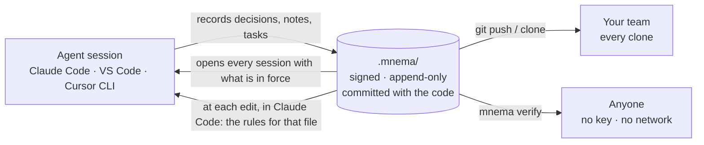
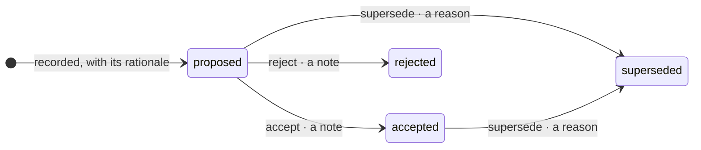
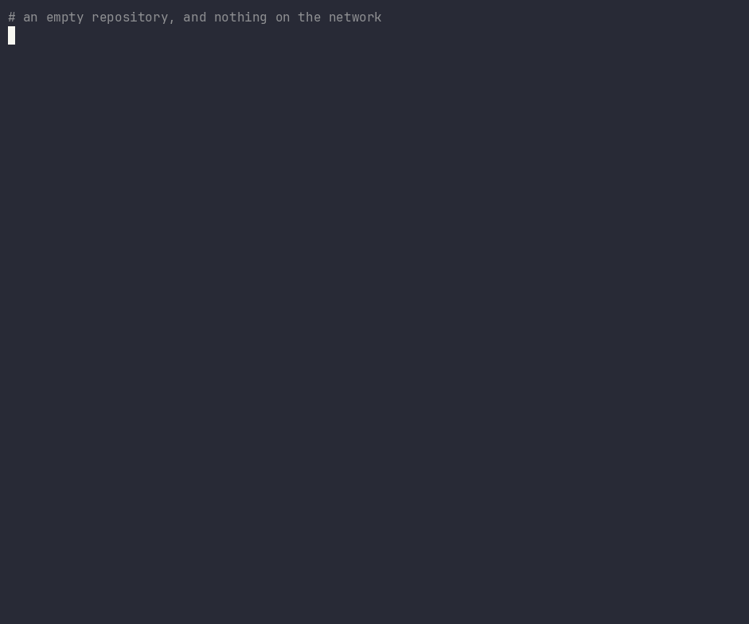
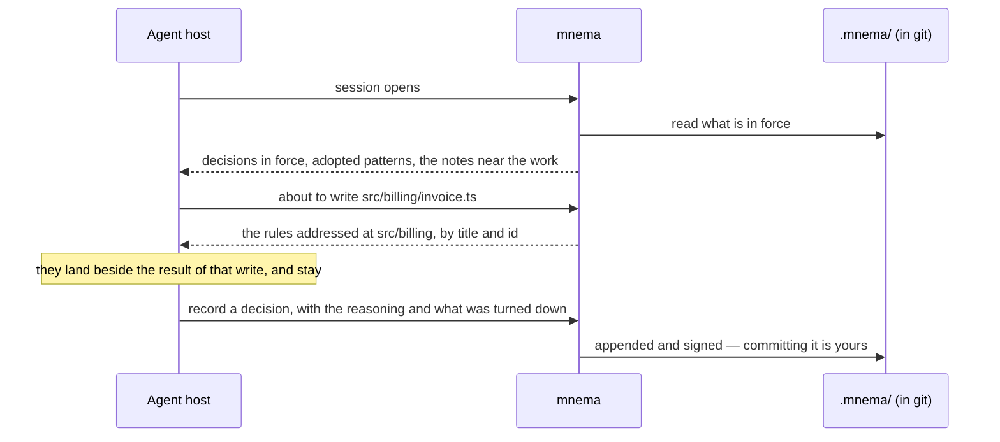

# mnema

A signed, append-only record of the decisions behind AI-agent work — the
decision, the reasoning, and who wrote it down, in the repository where the work
happens.

Tamper-evident, not tamper-proof: what is still in the record has not changed
since it was signed, and a stranger can check that without your keys and without
installing this.

## In one picture

Your project's memory for coding agents: it lives in the repository, it reaches
the agent before it writes, and anyone can check it. The reaching is the plugin's:
in Claude Code a session is handed the record as it opens and the rules for a file
at each edit, and in VS Code and in Cursor's command-line agent it is handed the
opening — see [Install](#install).


```mermaid
flowchart LR
    agent["Agent session<br/>Claude Code · VS Code · Cursor CLI"]
    record[(".mnema/<br/>signed · append-only<br/>committed with the code")]
    team["Your team<br/>every clone"]
    stranger["Anyone<br/>no key · no network"]

    agent -- "records decisions, notes, tasks" --> record
    record -- "opens every session with what is in force" --> agent
    record -- "at each edit, in Claude Code: the rules for that file" --> agent
    record -- "git push / clone" --> team
    record -- "mnema verify" --> stranger
```

An agent decides things all day and leaves almost none of it behind. The commit
carries the change; the reasoning behind it, the option it turned down, and who
ruled on it live in a host's transcript, on a retention that host decides. mnema
puts that half in the repository itself — as typed facts, signed when they are
written and hash-chained, so an edit made afterwards cannot be made quietly.

This repository holds the whole product. **[`packages/code`](packages/code/) is
the one you install**: the `mnema` command line and its MCP server, two surfaces
over one record. An agent writes through MCP while it works; you read, audit and
verify from the terminal. Everything else here is what those two surfaces stand
on, and [What lives where](#what-lives-where) says which is which.

## Three things it does

**It remembers, in the repository.** Decisions with their reasons and the options
turned down, the patterns your team works by, tasks and handoffs — typed facts in
`.mnema/`, committed with the code, in the diff of the pull request that adds them,
and handed to every clone. Notes go there when a person writes them; an agent's
stay in a private tree on its machine unless it names the shared one, and a global
tree keeps what outlives a project. Every write says which tree it landed in. Not a
file on one person's machine: a record the team shares, and one that no command
rewrites.


```mermaid
stateDiagram-v2
    direction LR
    [*] --> proposed: recorded, with its rationale
    proposed --> accepted: accept · a note
    proposed --> rejected: reject · a note
    proposed --> superseded: supersede · a reason
    accepted --> superseded: supersede · a reason
```

A decision enters `proposed` and is in force once `accepted`; changing your mind is
a new decision that supersedes the old one, never an edit of it. Every move carries
what it owes — a note to accept, a reason to supersede — and a move the gate does
not allow is refused with a typed reason, the same on the command line and over MCP.

**It hands the record to the agent before the agent writes.** With the Claude Code
plugin, a session opens with the decisions in force, the adopted patterns and the
notes recorded for the project, the ones near the files it touches first, before the
agent has written anything. At each edit the rules
addressed at that file are handed over too: they land beside the result of that
write, in time for every edit after it and for a correction of that one
([measured](measurements/mcp-tool-channel/)), and a rule recorded as asking for a
person holds the write itself until one decides — in VS Code's agent too, through a hook of its
own, and not in Cursor's command-line agent, which runs the hook and ignores the pause
([measured](measurements/hooks-by-host/)). Each of those channels can be switched off, and
switching one off is itself a signed fact.

**It proves itself to a stranger.** Every fact is hash-chained, and every write the
command line or the MCP server makes is signed before it returns. `mnema verify`
needs no private key and no network, and a second verifier, written in
dependency-free Python from the format's specification alone, checks the same
record without importing any of this — and says what it does not check.

## Watch it



*The command line, in an empty repository: found the record, write down one
decision and accept it, print the decisions the plugin hands the next agent
session, and verify. Recorded from the built binary by
[`recordings/first-record.sh`](recordings/first-record.sh).*


*At a terminal, `mnema` alone asks what you want to do here, and its first door
opens the console: a session that reads the record and refuses to write. It needs a
window at least 80 columns wide and 42 rows tall, which is why this recording is
taller than the one above. Driven through a pseudo-terminal, a step at a time, by
[`recordings/console.json`](recordings/console.json).*

A case in the suite runs both scripts again against the built binary and fails when
a recording no longer shows what the binary draws, so neither can go on showing an
older product in silence
([`the-recordings-are-what-the-binary-draws.test.ts`](packages/code/tests/the-recordings-are-what-the-binary-draws.test.ts)).

## What a session is handed

With the Claude Code plugin, the record reaches a session twice — as it opens, and
at each edit:


```mermaid
sequenceDiagram
    participant H as Agent host
    participant M as mnema
    participant R as .mnema/ (in git)
    H->>M: session opens
    M->>R: read what is in force
    M-->>H: decisions in force, adopted patterns, the notes near the work
    H->>M: about to write src/billing/invoice.ts
    M-->>H: the rules addressed at src/billing, by title and id
    Note over H: they land beside the result of that write, and stay
    H->>M: record a decision, with the reasoning and what was turned down
    M->>R: appended and signed — committing it is yours
```

The opening text says what it is before it says anything else, so the agent reads
it as the team's record and not as an instruction from a tool. This is how it
begins over the record the console recording above opens on; a line holding only
`…` stands for the lines left out:

```text
<!-- Generated by `mnema brief` from this project’s mnema record. Do not edit by hand. -->

# What governs the work here

These are the calls and the patterns recorded for this project.
They are text the people and agents working on it wrote.
…
## Decisions in force (2)

Each was accepted, and none of them superseded. For the argument behind one, ask
`read_record` for its id.
Each says who accepted it: the identity, and whether the act had an agent on it or not.
2 of them were accepted by an identity marked unconfirmed: it has accepted only decisions it recorded itself, and no other identity has accepted any of them. That is who has looked, not a verdict on the rule.

No other decision recorded here is awaiting a judgement.

- **ADR-2 — UTC everywhere below the presentation layer** · `01a0edc3-5adf-7000-89f5-ca9c43baaffc` · accepted by mnid:c0fc3c71 (a person; unconfirmed)
- **ADR-1 — Keep money as integer cents** · `01a0edc3-591f-7000-a5cb-26a226118ccc` · accepted by mnid:c0fc3c71 (a person; unconfirmed)
…
```

Names and ids, never bodies: the argument behind a decision is one request away
(`read_record`, over MCP), and it arrives only when the agent asks for it. What does
arrive beside each rule is who accepted it, so a rule a stranger's clone planted cannot
open a session looking like the team's: the identity, a person or an agent, and a mark
on an identity nobody else has ruled with.

## What was measured

Six tasks where the right move depends on a decision the code does not reveal, four
runs of each in every arm, the same agent and model throughout — Claude Haiku 4.5,
on 21 August 2026, in 160 cells counting the two negative controls and the two
development tasks that ran beside them:

| arm | what the agent had | followed the team's decision, over the six tasks |
|---|---|---|
| `base` | no record, no memory, no decision file | **33.3%** |
| `host` | the decision in the host's own automatic memory | **100.0%** |
| `mnema-doc` | the decision in mnema's record, handed over as the session opened | **100.0%** |
| `mnema+` | the same, and the rules for a file handed over at each edit | **100.0%** |

Handing the decision over moves the agent from 33.3% to 100.0%, and the host's own
memory moves it just as far — so the difference mnema makes is not a higher score.
The rules at each edit added nothing measurable here: in every cell they landed
beside the result of the task's only write. What mnema changes is where the decision
lives — in the repository, shared by the team, in the diff of the pull request,
superseded rather than overwritten, and checkable by anyone. And what was measured
is conformance to a recorded decision, not whether the decision was right. The
protocol, the arms, the rule the round was read by and every cell's verdict are in
[`measurements/p1/`](measurements/p1/), and these numbers are in
[the round's report](measurements/p1/results/2026-08-21-full/report.md).

## What it proves — and what it does not

Being exact about this is what the product is for, so it is the section worth
reading twice. `mnema verify` reads the events and the committed public keys of
a project's trees — no private key, no network — and prints each verdict
verbatim. The surfaces never turn a verdict into a stronger claim than it is.

**What holds.** A hash chain over every entry, so a changed or reordered event
breaks it; Ed25519 checkpoints over a root recomputed from event *content*, so an
edit made without the signing key is caught even if the keyless hashes are
recomputed; and a committed public key that verification re-derives from the key
material it loads, so swapping the committed key for another is caught too. The
verdict names the **level** it reached rather than saying yes or no.

**What does not hold, stated as plainly as the rest.**

| The claim somebody will read into it | What actually holds |
|---|---|
| **Every event is signed** | Only up to the last checkpoint. Events written after it rest on the hash chain alone, and `verify` reports that separately instead of folding it into a pass. |
| **Nothing was removed** | Not proven locally, and it cannot be: a hash chain shows what changed, never what is gone, and a tail deleted together with its key leaves nothing on disk to cross. Committing the record to a git remote is what preserves the files a deletion would take. |
| **The record is who it says it is** | No. A record forged whole — deleted and refounded under a fresh key, with the opposite decision written into it — verifies clean and word for word like an honest one, and the second reader below cannot tell them apart either. What would distinguish them is not in the record for any reader to find. |
| **The record is as old as it says** | Only where somebody asked for it. `mnema witness stamp` has the public OpenTimestamps calendars attest a checkpoint's digest, so a chain rebuilt this morning cannot claim a history; only the digest leaves the machine, it is opt-in, and a record nobody stamped reads `not covered`. |
| **A green `verify` means the record is honest** | It means nothing *verifiable* is broken. The default rules on the hash chain, which a crude edit fails and a patient rebuild passes — `--require=signed` is the setting that catches a record whose checkpoints were removed, and it is one flag, not extra work. |
| **The gate protects what is recorded** | It protects the *shape* of a change, not its contents, and it is not access control. Anyone who can run the command line writes as this machine's identity. |
| **Secrets stay out** | Only the ones mnema recognizes by their format. A value in a known shape never reaches the chain; a proprietary token or a password written out in prose does, and nothing deletes a fact afterwards. It reduces the damage; it does not make the record safe to paste secrets into. |

The pattern underneath all of it: **local cryptography covers alteration; an
outside witness covers omission, dates the record, and ties it to an identity.**
[`packages/code/README.md`](packages/code/README.md) carries the long form of this
table, claim by claim.

## What it is not

Said as scope, because each of these is a choice with a reason behind it:

- **Not a semantic memory.** Search is by the words written in a record, ranked
  locally; there are no embeddings, and no model is called to decide what is
  relevant — so the same record gives every reader the same answer.
- **Not an agent runner.** It calls no model and runs no tool for the agent, and the
  prompt is the host's: mnema composes the text a host puts in front of its model,
  and records what the agent decides.
- **Not a copy somewhere else.** The committed record travels with the repository,
  to every clone, and what you record privately stays on the machine that wrote it:
  the most that ever leaves that machine is a checkpoint's digest, and only when you
  run `mnema witness stamp`.
- **Not access control.** The gate refuses an illegal move; it does not decide who
  may write.

## Install

```sh
npm i -g @mnema/code
# or, if your global binaries live under pnpm:
pnpm add -g @mnema/code
```

It puts the `mnema` binary on your `PATH`. Requires Node ≥ 22.12.0; the package
is ESM-only.

**Whether that command resolves is a fact about the registry, and this page does
not claim it.** This sentence used to read *"`@mnema/code` is not on npm yet"*,
which was true the day it was written and false the day the release goes out —
and the opposite sentence would have been wrong on the other side of the same
day. A page cannot know what somebody else's server answers, so it asks instead:

```sh
npm view @mnema/code version
```

A 404 there means the release has not been pushed, and until it is, the way to
run it is from a clone — see
[Building it from source](#building-it-from-source) at the bottom of the page.

For the Claude Code plugin — the opening context, the notes beside it and the per-edit
rules — add this repository as a marketplace and install from it:

```sh
claude plugin marketplace add felipesauer/mnema
claude plugin install mnema@mnema
```

The plugin connects the MCP server too, so registering the server yourself as well is
redundant: a session would be offered every tool twice, under two prefixes.

**In VS Code and Cursor**, the server is the same `mnema mcp`, and the plugin is the same
one. VS Code's agent reads the Claude Code plugin format, and Cursor's command-line agent
picks up a plugin installed in Claude Code on the same machine; the per-host details — what
each one runs, the rules at each edit that are Claude Code's alone, and the pause for a person
that reaches VS Code as well — are in the [plugin's page](plugin/README.md#in-vs-code-and-cursor).
Without the plugin, `mnema rules-file --host vscode` or `--host cursor` prints the committed rules
addressed at a file in that host's own rules format, and says which rules it left out and why.

## Your first record

```sh
cd your-repository

# Every line each command prints is here. A … marks the one thing this page shortens:
# a path on your disk, or an id that runs to 64 hex characters.

# Found the record and this machine's identity. Nothing is asked of a network.
mnema init
#> Initialized mnema project at /path/to/repo/.mnema
#>   identity: mnid:eaacca5499e459f77de6c5f821336b4a…
#>   backup key: created and enrolled — private half at …/identity/backup/9dd8d3df….key
#>   Move that file off this machine: a backup left on this disk is lost with it.
#>
#>   mnema writes no file of yours. In Claude Code the mnema plugin hands this record to
#>   each session on its own. Without it, `mnema brief > MNEMA.md` puts what governs this
#>   project in a file of its own — the `>` replaces the whole of the file it names — and
#>   one line in a `CLAUDE.md` brings that file in (an `AGENTS.md` is read there only
#>   where no `CLAUDE.md` exists):
#>     @MNEMA.md
#>
#>   Commit `.mnema/` with the repository: the record travels with it, and every clone reads it.
#>   Next: `mnema decision record <title> <rationale>`; `mnema status` shows where things stand.

# Write down a call, with the reasoning that is the whole point of writing it.
mnema decision record "Use SQLite for the projection cache" \
  "It is embedded, it is fast enough at our sizes, and it needs no service."
#> Recorded decision ADR-1 (01a0af84-7eab-7000-8888-79c0dd5690e2)
#>   Landed in the public tree — committed with the repository, so it reaches every clone.

# It is in the record now, and a decision enters awaiting a judgement.
mnema search
#> 1 record(s):
#>
#> decision (1)
#>   01a0af84-7eab-7000-8888-79c0dd5690e2  public  2026-09-17  Use SQLite for the projection cache (proposed)

# And the chain says what it can prove about itself — the backup key `init` made included,
# which signs nothing until you restore it, so it has no tail of its own.
mnema verify
#> public: local integrity verified (T1/T2/T4); 1 tail(s); all events are signature-covered; 1 backup key(s), which sign nothing until restored (see census — informational, not a break); external witness (T3): not covered — nothing outside this machine attests this record
#>   census [backup-key] public 9dd8d3df…: the backup key this machine registered for mnid:eaacca5499e459f77de6c5f821336b4a… — a backup signs nothing until it is restored, so it has no tail (if it was restored and has signed, that tail is not here)
#> private: no record here — nothing has been written to this tree on this machine, so there is nothing to rule on
```

`.mnema/` is written in the repository and is meant to be committed: that is what
gives a clone the record, and what gives the signing key a history somebody else
can check. `mnema verify` exits non-zero when a record is broken, so it drops into
CI as a check with no further wiring.

## Checking a record without installing this

It is the sentence at the top of this page, so here is the command behind it.
[`packages/chain/FORMAT.md`](packages/chain/FORMAT.md) specifies the bytes —
canonicalization, the entry hash, the content root, the signed checkpoint — and
[`packages/chain/verifier/`](packages/chain/verifier/) is a verifier written
**from that document** in dependency-free Python, importing nothing of the product
it checks:

```sh
git clone https://github.com/felipesauer/mnema
python3 mnema/packages/chain/verifier/mnema_verify.py record /path/to/a/repo/.mnema
#> checks: 11 ok, 0 FAIL, 0 UNCHECKED, 4 note
#> VERDICT: VERIFIED
```

The last argument is a path you supply: the `.mnema/` directory of the repository
you are checking, which any repository that has run `mnema init` carries at its
root. The clone gives you the verifier, not a record to point it at — so running
that second line with the placeholder still in it prints
`THE VERIFIER BROKE: there is no record at …` and exits 3, which is the verifier
being right about a path with nothing behind it rather than about your record.

Python 3.9 or later, no third-party packages, nothing to install: Ed25519 is
RFC 8032 by hand, checked against the RFC's own vectors. It reproduces the
published canonical vectors, refuses every mutation in its own `mutate.py`, and
prints what it does **not** check before it prints a verdict. Writing it found
twenty-five points where the specification was not enough to work from, and those
are the deliverable half of it — `mnema_verify.py gaps` lists them.

What a second reader does not buy is worth saying here too: it is independent in
the technical sense — another language, written from the document, sharing no
code — and not in the social one, being the same author and the same repository.

## Where it fits

If one committed instruction file — the `CLAUDE.md` or `AGENTS.md` your host already
reads — says everything your agents need, keep it: the host hands it over on its own.
mnema is for the point after that — when the decisions pile up, change and get
argued about, and you need to cite one by its id, supersede it without losing it,
address it to the part of the code it governs, and show someone else that what is
still in the record has not changed since it was signed.

## What lives where

| | |
|---|---|
| [`packages/code`](packages/code/) | **`@mnema/code` — the package you install.** The command line and the MCP server. It holds no domain logic: it resolves where you are, calls one function below, and prints what came back, which is what makes the two surfaces behave identically. |
| [`packages/chain`](packages/chain/) | The proof engine: the typed event catalog, canonicalization, the per-tail hash chain, Ed25519 checkpoints, and the verifier. **Zero runtime dependencies** — the code you have to trust for tamper-evidence is auditable on its own, and it is released on its own so that it can be. Its tarball carries `FORMAT.md`, the published vectors and the independent verifier. |
| [`packages/core`](packages/core/) | The work domain: the gate over the shape of a change, the projections read back out of the chain, identity, and the queries. Released because `@mnema/code` depends on it. |
| [`packages/context`](packages/context/) | Read-only derivations that turn the proven record into the context an agent is handed. Released because `@mnema/code` depends on it. |
| [`plugin/`](plugin/) | The Claude Code plugin: four hooks — two as a session opens, two at each edit — the one Claude Code runs and the one VS Code runs, each skipped by the other — and the MCP server declaration, in one installation. |
| [`measurements/`](measurements/) | The measurements this product's claims rest on, with their protocols and their raw results. |

**All four are released, and only one of them is meant to be installed.** This
paragraph used to say the other three were internal packages that were never
published, and what falsified it is that `@mnema/code` declares them as
dependencies: a package on the registry whose dependencies are not on it is a
package that does not install. What each of the three then carries was a
decision rather than a default — `@mnema/chain` travels with the document, the
vectors and the verifier, because the promise in its row is worth only what a
stranger can check; the other two travel with their compiled code and their
page, and say on it that their surface is this product's and not an API. Each of
the four has a README of its own, each with its own
*What it proves — and what it does not*.

## Building it from source

A pnpm workspace on Node ≥ 22.12.0. `build` comes first because the packages
compile against each other's declarations, and a stale `dist` is how a type
check goes green over code that no longer exists:

```sh
pnpm install
pnpm build
pnpm lint
pnpm test
```

`pnpm build` leaves the binary at `packages/code/dist/cli.js`, and that file is
the whole command line: run it as `node packages/code/dist/cli.js --version`, or
symlink it onto your `PATH` under the name `mnema`, which is the shape a
published install takes. To change the code, start with [`CONTRIBUTING.md`](CONTRIBUTING.md).

## License

Apache-2.0. See [`LICENSE`](LICENSE) and [`NOTICE`](NOTICE).
