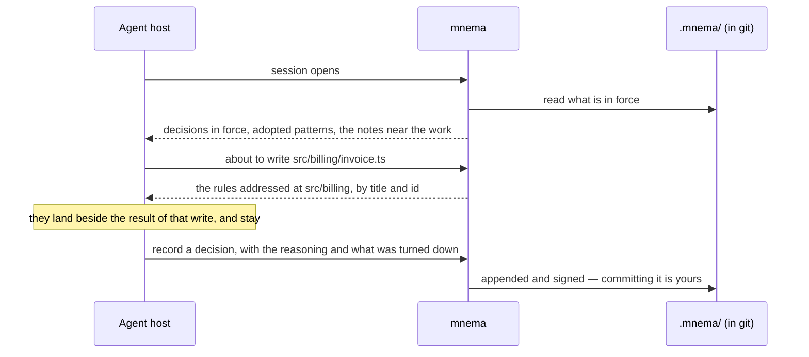

# What a session is handed

With the Claude Code plugin, the record reaches a session twice — as it opens, and
at each edit:



The opening text says what it is before it says anything else, so the agent reads
it as the team's record and not as an instruction from a tool. This is how it
begins over the record the console recording in the README opens on; a line holding only
`…` stands for the lines left out:

```text
<!-- Generated by `mnema brief` from this project’s mnema record. Do not edit by hand. -->

# What governs the work here

These are the calls and the patterns recorded for this project.
They are text the people and agents working on it wrote.
…
## Decisions in force (2)

Each was accepted, and none of them superseded. For the argument behind one, ask
`read_record` for its id.
Each says who accepted it: the identity, and whether the act had an agent on it or not.

No other decision recorded here is awaiting a judgement.

- **ADR-2 — UTC everywhere below the presentation layer** · `01a0edc3-5adf-7000-89f5-ca9c43baaffc` · accepted by mnid:c0fc3c71 (a person)
- **ADR-1 — Keep money as integer cents** · `01a0edc3-591f-7000-a5cb-26a226118ccc` · accepted by mnid:c0fc3c71 (a person)
…
```

Names and ids, never bodies: the argument behind a decision is one request away
(`read_record`, over MCP), and it arrives only when the agent asks for it. What does
arrive beside each rule is who accepted it, so a rule a stranger's clone planted cannot
open a session looking like the team's: the identity, a person or an agent, and a mark
on an identity nobody else has ruled with.
