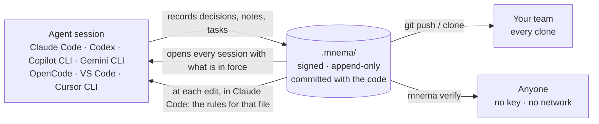
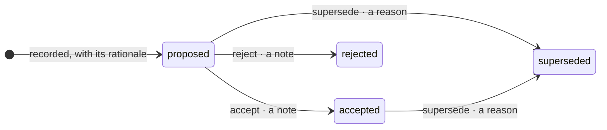

# In one picture

The decisions behind your agents' work, kept where the work is: the record lives
in the repository, it reaches the agent before it writes, and anyone can check it. The reaching is the plugin's:
in Claude Code a session is handed the record as it opens and the rules for a file
at each edit, and in the other hosts with a plugin — VS Code, Cursor's command-line agent,
Codex, Copilot CLI, Gemini CLI and OpenCode — it is handed the opening; how far each host goes is
[its rung](evidence.md#each-hosts-rung), and how to install it is in [Install](install.md).



An agent decides things all day and leaves almost none of it behind. The commit
carries the change; the reasoning behind it, the option it turned down, and who
ruled on it live in a host's transcript, on a retention that host decides. mnema
puts that half in the repository itself — as typed facts, signed when they are
written and hash-chained, so an edit made afterwards cannot be made quietly.

This repository holds the whole product. **[`packages/code`](../packages/code/) is
the one you install**: the `mnema` command line and its MCP server, two surfaces
over one record. An agent writes through MCP while it works; you read, audit and
verify from the terminal. Everything else here is what those two surfaces stand
on, and [What lives where](packages.md) says which is which.

## Three things it does

**It remembers, in the repository.** Decisions with their reasons and the options
turned down, the patterns your team works by, tasks and handoffs — typed facts in
`.mnema/`, committed with the code, in the diff of the pull request that adds them,
and handed to every clone. Notes go there when a person writes them; an agent's
stay in a private tree on its machine unless it names the shared one, and a global
tree keeps what outlives a project. Every write says which tree it landed in. Not a
file on one person's machine: a record the team shares, and one that no command
rewrites.



A decision enters `proposed` and is in force once `accepted`; changing your mind is
a new decision that supersedes the old one, never an edit of it. Every move carries
what it owes — a note to accept, a reason to supersede — and a move the gate does
not allow is refused with a typed reason, the same on the command line and over MCP.

The `ADR-1` that `decision record` printed is the decision's **label**, and the move takes
its **id**, the value in the parentheses beside it:

```sh
mnema decision move accept 01a0af84-7eab-7000-8888-79c0dd5690e2 --note "agreed in review"
#> Decision ADR-1 (01a0af84-7eab-7000-8888-79c0dd5690e2) → accepted
```

A label is numbered inside one tree, so the committed tree and a machine's private one can
each hold an `ADR-1`, and a name that can mean two decisions is no address. Hand `move` the
label and it refuses, and says which id, or which ids, carry it here.

That diagram is the output of `mnema diagram decision`, read from the gate's own table;
`skill` and `task` print theirs, and `timeline <id>` and `refs <id>` draw one entity's
history and connections. It is mermaid text on stdout, and it writes nothing.

**It hands the record to the agent before the agent writes.** With the Claude Code
plugin, a session opens with the decisions in force, the adopted patterns and the
notes recorded for the project, the ones near the files it touches first, before the
agent has written anything. At each edit the rules
addressed at that file are handed over too: they land beside the result of that
write, in time for every edit after it and for a correction of that one
(read on Claude Code 2.1.228 and 2.1.281; [`the-rule-reaches-the-writing.test.ts`](../packages/code/tests/the-rule-reaches-the-writing.test.ts) holds the product's half), and a rule recorded as asking for a
person holds the write itself until one decides — in VS Code's agent and Copilot CLI too, through
a hook of their own, and not in Cursor's command-line agent, Codex, Gemini CLI or OpenCode, which
refuse a write and do not pause one ([how each claim is held](evidence.md#each-hosts-rung)). Each of those channels can be switched off, and
switching one off is itself a signed fact.

**It proves itself to a stranger.** Every fact is hash-chained, and every write the
command line or the MCP server makes is signed before it returns. `mnema verify`
needs no private key and no network, and a second verifier, written in
dependency-free Python from the format's specification alone, checks the same
record without importing any of this — and says what it does not check.
